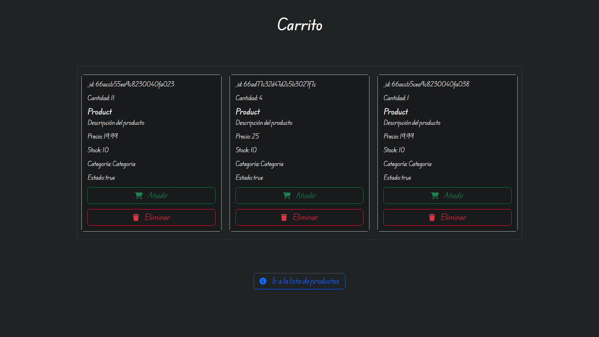
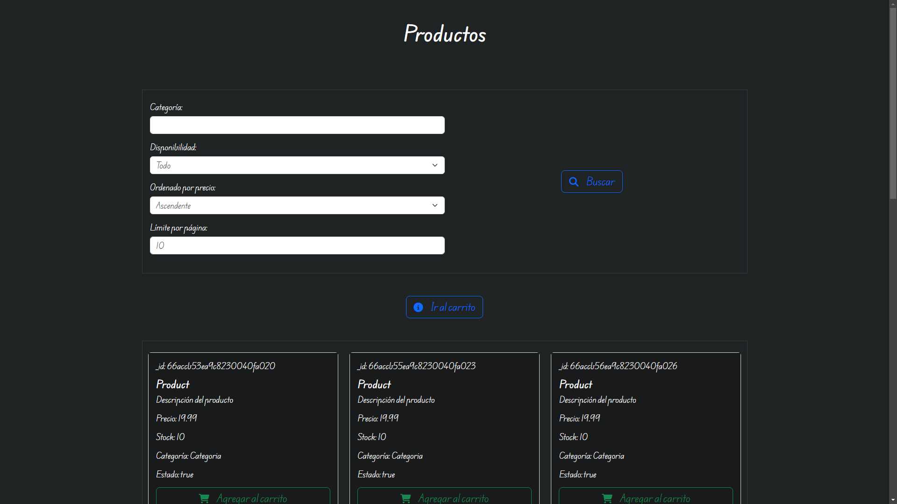
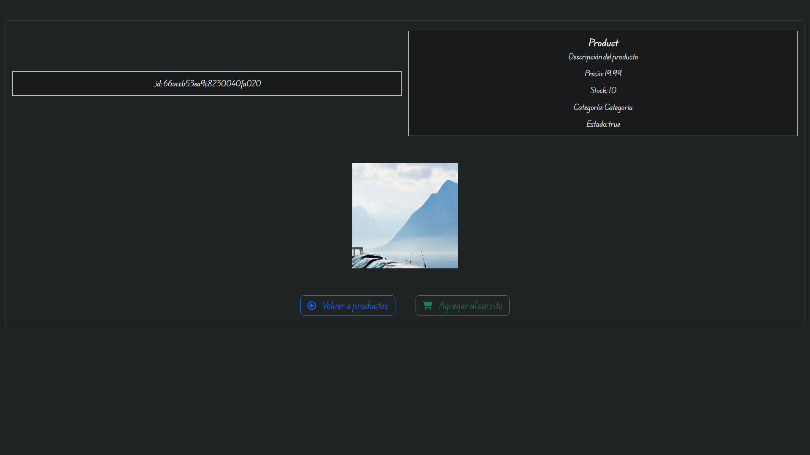

# Node project

A Node project made with Express, where it is carried out thanks to the React course from Coderhouse

## Screenshots








## Tools Used

- Node
- Express
- Handlebars
- Mongoose
- Mongoose Paginate V2

## Installation and Testing

Process of installation (is not necessary if you have this proyect)

* Initialize a new npm project: `npm init -y`

* Modify package.json: `"test": "node --watch src/app.js"`

## The following installation is required:

* Install: `npm install express express-handlebars mongoose mongoose-paginate-v2 @fortawesome/fontawesome-free`

## Testing

```bash
  npm start
```

## In the browser

```http
  http://localhost:8080/carts/:cid
```

```http
  http://localhost:8080/products
```

```http
  http://localhost:8080/products/:pid
```

# In Postman:

## Products

```http
  GET http://localhost:8080/api/products/
```

```http
  GET http://localhost:8080/api/products/:pid
```

```http
  POST http://localhost:8080/api/products/
```

```http
  PUT http://localhost:8080/api/products/:pid
```

```http
  DELETE http://localhost:8080/api/products/:pid
```

| Parameter     | Type      | Description                           |
|:--------------|:----------|:--------------------------------------|
| `_id`         | `number`  | **Not required**. Your product id key |
| `title`       | `string`  | **Required**. Your title              |
| `description` | `string`  | **Required**. Your description        |
| `code`        | `string`  | **Required**. Your code               |
| `price`       | `number`  | **Required**. Your price              |
| `status`      | `boolean` | **Not required**. Your status         |
| `stock`       | `number`  | **Required**. Your stock              |
| `category`    | `string`  | **Required**. Your category           |
| `thumbnails`  | `array`   | **Not required**. Your thumbnails     |

### Note: `price` and `stock` must be greater than or equal to 0.

## Carts

```http
  GET http://localhost:8080/api/carts/
```

```http
  GET http://localhost:8080/api/carts/:cid
```

```http
  POST http://localhost:8080/api/carts/
```

```http
  POST http://localhost:8080/api/carts/:cid/products/:pid
```

```http
  DELETE http://localhost:8080/api/carts/:cid/products/:pid
```

```http
  PUT http://localhost:8080/api/carts/:cid
```

```http
  PUT http://localhost:8080/api/carts/:cid/products/:pid
```

```http
  DELETE http://localhost:8080/api/carts/:cid
```

### Cart Schema

| Parameter  | Type     | Description                        |
|:-----------|:---------|:-----------------------------------|
| `_id`      | `ObjectId` | **Not required**. Your cart id key |
| `products` | `array`  | **Required**. Your products        |

### For products parameter

| Parameter  | Type       | Description                                    |
|:-----------|:-----------|:-----------------------------------------------|
| `_id`      | `ObjectId` | **Not required**. Your product id key          |
| `quantity` | `number`   | **Required**. Your quantity                    |
| `product`  | `ObjectId` | **Required**. The referenced product id key    |

### Note: `quantity` must be greater than or equal to 1.


## Authors

- [@Juan Ignacio Caprioli (ChanoChoca)](https://github.com/ChanoChoca)


## Badges

[//]: # (Add badges from somewhere like: [shields.io]&#40;https://shields.io/&#41;)

[](https://choosealicense.com/licenses/mit/)
[](https://opensource.org/licenses/)
[](http://www.gnu.org/licenses/agpl-3.0)
